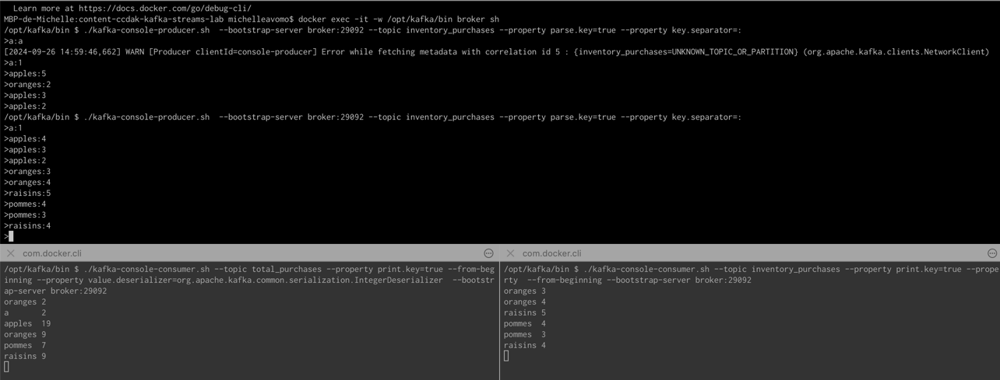

## inventory_purchases (Producer)
> ./kafka-console-producer.sh  --bootstrap-server broker:29092 --topic inventory_purchases --property parse.key=true --property key.separator=:

## inventory_purchases (Consumer)
>  ./kafka-console-consumer.sh --topic inventory_purchases --property print.key=true --prope
rty  --from-beginning --bootstrap-server broker:29092 

## total_purchases (Consumer)
> /kafka-console-consumer.sh --topic total_purchases --property print.key=true --from-beg
inning --property value.deserializer=org.apache.kafka.common.serialization.IntegerDeserializer  --bootstr
ap-server broker:29092

## Result

